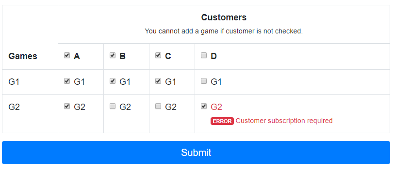

# Can't add errors using the Callback constraint.
Small reproducer that show a callback validator can't add a violation.

**Expected validation error: you cannot add a game if customer is not checked.**

Adding errors using `$field->addError(new FormError('Customer subscription required'));` is working but not using the Callback constraints.

A `Callback` constraint is added to the form using this:

```php
$form = $this->createFormBuilder($formData, [
    'constraints' => [
        new Callback([$this, 'validateCustomerSubscription']),
    ],
]);
```
But it is not possible to attach error to the field using this lines of code:

```php
$context
    ->buildViolation('Customer subscription required')
    ->atPath("children[games].children[$customerId].children[$gameId].data")
    ->addViolation();
```

The problem is due to the path `children[games].children[$customerId].children[$gameId].data` being modified to `data.children[games].children[$customerId].children[$gameId].data`.

I guess this path by having a look at the debug bar. Uncomment `new EqualTo(false)` to compare paths.

 
 

## How to run the reproducer

* git clone
* composer install
* php bin/console server:start
* navigate to https://127.0.0.1:8000/form
* check the the controller `App\Controller\FormController` located in  src/Controller/FormControllers

## Environment:

* php 7.2.27
* Windows 10 V 1903 - OS version 18362.720
* Symfony 5.0.6

#### php -v

```
PHP 7.2.27 (cli) (built: Jan 22 2020 11:54:46) ( NTS MSVC15 (Visual C++ 2017) x64 )
Copyright (c) 1997-2018 The PHP Group
Zend Engine v3.2.0, Copyright (c) 1998-2018 Zend Technologies
with Zend OPcache v7.2.27, Copyright (c) 1999-2018, by Zend Technologies
``` 

#### php -m

```
[PHP Modules]
amqp
bcmath
calendar
Core
ctype
curl
date
dom
exif
fileinfo
filter
gd
gettext
hash
iconv
intl
json
ldap
libxml
mbstring
mysqlnd
openssl
pcre
PDO
pdo_mysql
pdo_pgsql
pdo_sqlite
Phar
readline
Reflection
session
SimpleXML
sodium
SPL
standard
tokenizer
wddx
xml
xmlreader
xmlwriter
xsl
Zend OPcache
zip
zlib

[Zend Modules]
Zend OPcache
```